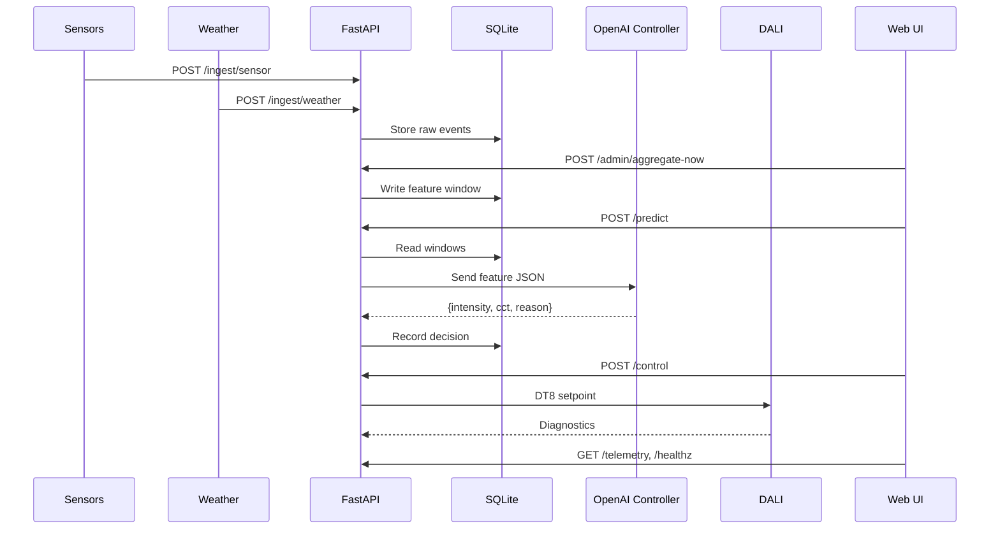

# Smart Lighting AI for DALI

Smart Lighting AI for DALI is a control platform that blends real-time building telemetry, participant preferences, and generative AI recommendations to keep luminaires comfortable, accessible, and energy efficient.  

The application exposes a REST API and a local web console so facilities teams can ingest sensor data, trigger AI predictions, and drive Digital Addressable Lighting Interface (DALI) fixtures with either production hardware or a high-fidelity mock controller.

---

## 🚀 Executive Overview

**Key value drivers:**

- **Comfort & Accessibility**  
  AI-driven setpoints respect occupancy, ambient lux, and user profiles that capture chronotype, visual impairments, and consent.  

- **Operational Resilience**  
  A deterministic fallback, in-memory rate limiting, and background feature aggregation keep decisions flowing even without external AI connectivity.  

- **Governance-First Design**  
  Personally identifiable data is encrypted with Fernet, admin actions require a bearer token, and retention jobs purge stale records on a schedule.  

---

## System Architecture

```mermaid
flowchart LR
    Sensors[Occupancy & Lux Sensors / Weather Feed / Profiles]
    API[FastAPI Service]
    DB[(SQLite / SQLAlchemy)]
    Scheduler[Feature & Retention Jobs]
    AI[OpenAI Controller (payload capped)]
    Control[Control Service]
    DALI[DALI Hardware (Mock or Tridonic USB)]
    UI[Local Web UI /ui]

    Sensors -->|/ingest| API
    API --> DB
    Scheduler --> DB
    DB -->|Feature windows| AI
    AI -->|Setpoint| Control
    Control -->|DT8 commands| DALI
    DALI -->|Diagnostics| API
    API --> UI
    UI -->|Admin + Ops| API

```

---

## 🔄 Sequence of Operations



---

## ⚙️ How to Run Locally

### 1. Clone the repo
```bash
git clone https://github.com/your-org/KOL.git
cd KOL
```

### 2. Install dependencies
```bash
pip install -r requirements.txt
```

### 3. Setup environment
Create a `.env` file (see `.env.example`):

```env
DB_URL=sqlite:///./kol.db
USE_MOCK_DALI=true
ENABLE_OPENAI=true
OPENAI_API_KEY=sk-xxxxxxx
OPENAI_MODEL=gpt-4o-mini
FERNET_KEY=your-generated-fernet-key
PAYLOAD_CAP_BYTES=8192
ADMIN_TOKEN=super-secret-admin-token
```

### 4. Start the API
```bash
uvicorn smart_lighting_ai_dali.main:app --reload
```

API will be available at:  
👉 [http://127.0.0.1:8000/docs](http://127.0.0.1:8000/docs)  

Web UI available at:  
👉 [http://127.0.0.1:8000/ui/](http://127.0.0.1:8000/ui/)  

---

## 📊 Key Endpoints

- `POST /ingest/sensor` – Send ambient lux & presence data  
- `POST /ingest/weather` – Send weather conditions  
- `POST /predict` – Get AI-generated lighting setpoints  
- `POST /control` – Apply lighting setpoints (intensity & CCT)  
- `GET /telemetry` – Fetch decision history  
- `GET /healthz` – System health check  
- `POST /admin/aggregate-now` – Force feature aggregation (requires `ADMIN_TOKEN`)  

---

## 🧪 Testing

Run all tests with:

```bash
python -m pytest -q
```

Expected:  
✅ All tests passing  

---

## 📦 Deployment Options

- **Prototype Mode** – Run with `USE_MOCK_DALI=true` to simulate lights without hardware.  
- **Production Mode** – Connect to Tridonic USB or other DALI DT8 hardware.  
- **Data Collection** – Store anonymized profiles and telemetry for model fine-tuning.  

---

## 📈 Roadmap

- Advanced profiles (personal chronotype, schedules, visual comfort)  
- Company-wide telemetry dashboards  
- Cloud integration with enterprise energy systems  
- Adaptive learning with feedback loops  

---

## 👥 Contributors

- Engineering: [Your Name / Team]  
- Design & UX: [Name]  
- Deployment & Integration: [Company / Lab]  

---

Smart Lighting AI can be deployed on a bench for rapid prototyping or in production alongside existing facility systems. With consistent APIs and encrypted storage, the platform is ready for incremental integration into enterprise energy management programs.
