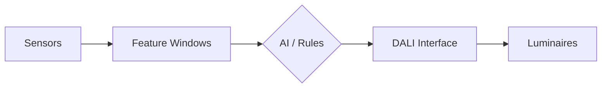
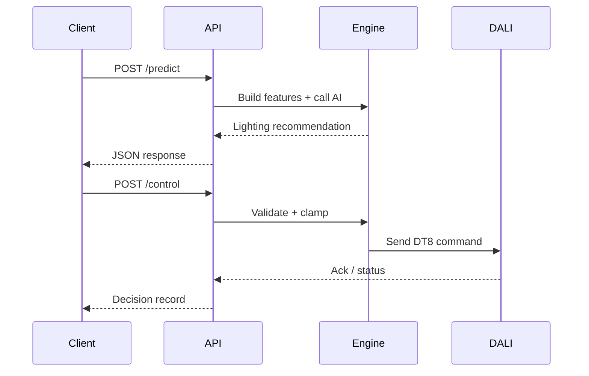
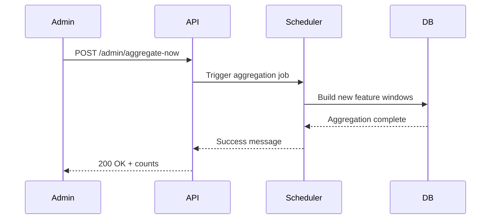

# Executive Overview

## What the System Does
- AI-assisted smart lighting controller tuned for comfort, accessibility, and energy savings.
- Connects to DALI luminaires to adjust intensity and color temperature automatically or by request.
- Works with manual overrides so occupants always stay in control.

## Key Data Inputs & Privacy
| Input | Description |
| --- | --- |
| Sensor windows | Rolling summaries of lux, occupancy, and prior commands.
| Weather snapshots | Temperature and daylight context fetched on schedule.
| User context | Chronotype and impairment flags stored in encrypted profiles.

**Privacy stance**
- Only aggregated windows are shared with the AI service.
- Payload size is capped and batches are limited before leaving the system.
- Identifiers are pseudonymized, and raw events stay inside the local database.

## Decision Flow
1. AI model generates the recommended lighting scene.
2. Rules engine validates outputs, applies accessibility clamps, and handles missing AI responses.
3. Anti-flicker logic smooths rapid changes before writing DALI commands.
4. Manual overrides take priority until they expire or are cleared by the user.

## Safety & Guardrails
- Payload cap, batch limit, and value clamping protect downstream services.
- Predict and control requests both enforce anti-flicker thresholds.
- All decisions are logged for audit with minimal personal data.

## Success Measures
| KPI | Description |
| --- | --- |
| Comfort proxy | Self-reported comfort rating or absence of override churn.
| Energy-saving estimate | Calculated against daylight baseline and historical usage.
| Uptime | Percentage of successful scheduler ticks and API responses.

## System Flow

## Request Flow

## Admin Flow

## Glossary
| Term | Meaning |
| --- | --- |
| chronotype | Preferred sleep/wake pattern that influences light needs.
| impairment_enum | Enum describing accessibility requirements (e.g., low vision).
| setpoint | Target intensity or color temperature the system aims to achieve.
| CCT | Correlated color temperature, measured in Kelvin.
| payload cap | Maximum bytes allowed in an outgoing AI payload.
