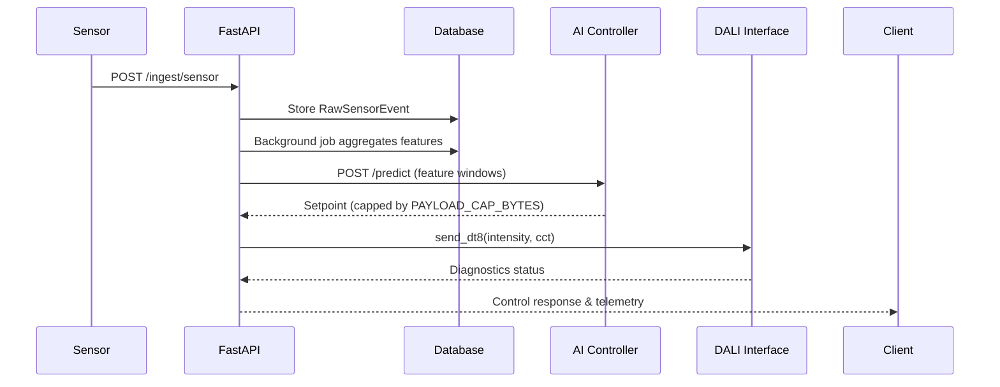

# API Reference

All endpoints are served over HTTP by FastAPI. Unless stated otherwise, responses are JSON and errors follow FastAPI's default structure (`{"detail": "..."}`). The service enforces an in-memory rate limit of 60 requests per 60 seconds per client IP.

## Authentication

- **Admin endpoints** require `Authorization: Bearer <ADMIN_TOKEN>`.
- **Profile read/write** and all other public endpoints do not require authentication but rely on transport security (deploy behind TLS in production).

## Common headers

| Header | When to use |
|--------|-------------|
| `Content-Type: application/json` | For all POST/DELETE requests with a JSON body. |
| `Authorization: Bearer <token>` | Required for `/admin/*` routes. |

## Endpoints

### `POST /ingest/sensor`

Registers raw ambient light and presence data.

**Request**

```json
{
  "ambient_lux": 315.2,
  "presence": true,
  "timestamp": "2024-06-15T11:03:22Z"
}
```

**Response**

```json
{ "id": 42 }
```

### `POST /ingest/weather`

Ingests weather context used in feature engineering.

**Request**

```json
{
  "weather_summary": "overcast",
  "temperature_c": 18.4,
  "sunrise": "2024-06-15T04:55:00Z",
  "sunset": "2024-06-15T21:14:00Z"
}
```

**Response**

```json
{ "id": 7 }
```

### `POST /predict`

Generates an AI-backed setpoint using recent feature windows. When no OpenAI client is available, the controller uses a deterministic fallback but still returns the `setpoint` payload.

**Request**

```json
{ "window_rows": 3 }
```

- `window_rows` is optional (defaults to `feature_history_rows`, max 3).

**Response**

```json
{
  "setpoint": {
    "intensity_0_100": 58,
    "cct_1800_6500": 4100,
    "reason": "Occupancy high, ambient 315 lux"
  },
  "payload_bytes": 612,
  "features_used": 3
}
```

**Error cases**

- `400 {"detail": "No features available"}` when the feature store is empty.
- `400 {"detail": "Payload exceeds cap"}` if feature payload size exceeds `PAYLOAD_CAP_BYTES`.

### `POST /control`

Applies a lighting state, respecting anti-flicker limits and active manual overrides.

**Request**

```json
{
  "intensity": 50,
  "cct": 3500,
  "reason": "Console adjustment",
  "source": "console",
  "manual_override": false
}
```

**Response**

```json
{
  "applied": true,
  "intensity": 48,
  "cct": 3500,
  "reason": "Console adjustment",
  "manual_override_applied": false
}
```

If a manual override is active, the response reflects the override intensity/CCT and sets `manual_override_applied` to `true`.

### `GET /telemetry`

Returns recent decisions with pagination.

**Query parameters**

- `limit` (default 25)
- `offset` (default 0)

**Response**

```json
{
  "items": [
    {
      "decided_at": "2024-06-15T11:05:01.123Z",
      "intensity": 45,
      "cct": 3900,
      "reason": "AI schedule alignment",
      "source": "ai",
      "energy_saving_estimate": 0.55
    }
  ],
  "next_offset": null,
  "limit": 25
}
```

### `GET /healthz`

Provides service health.

**Response**

```json
{
  "status": "ok",
  "database": "ok",
  "dali": "ok",
  "scheduler": "running"
}
```

### `POST /admin/aggregate-now`

Forces immediate feature aggregation using the configured window.

**Headers**

```
Authorization: Bearer <ADMIN_TOKEN>
```

**Response**

```json
{ "ok": true }
```

### `POST /profile`

Creates or updates an encrypted participant profile.

**Request**

```json
{
  "user_id": "alice",
  "consent": true,
  "age": 34,
  "sex": "female",
  "visual_impairment": "none",
  "chronotype": "intermediate",
  "schedules": { "Monday": "office", "Saturday": "rest" },
  "preferences": { "brightness_preference": "soft" }
}
```

**Response**

```json
{ "status": "created" }
```

### `GET /profile/{user_id}`

Retrieves a decrypted profile, ensuring `user_id` and `consent` fields are present.

**Response**

```json
{
  "user_id": "alice",
  "consent": true,
  "age": 34,
  "sex": "female",
  "visual_impairment": "none",
  "chronotype": "intermediate",
  "schedules": { "Monday": "office" },
  "preferences": { "brightness_preference": "soft" }
}
```

### `DELETE /admin/profile/{user_id}`

Deletes an encrypted profile. Requires the admin bearer token.

**Response**

```json
{ "ok": true }
```

## Sequence overview



## Notes on AI integration

- The OpenAI client is instantiated when `OPENAI_API_KEY` is present. If the SDK is missing or the key is empty, predictions use the deterministic fallback.
- `OPENAI_MODEL` overrides the default `gpt-4o-mini`. `ENABLE_OPENAI` is not evaluated by the codebase; leaving `OPENAI_API_KEY` empty effectively disables AI.
- Payloads larger than `PAYLOAD_CAP_BYTES` or batches larger than `payload_batch_limit` trigger a 400 error before any external calls are made.
